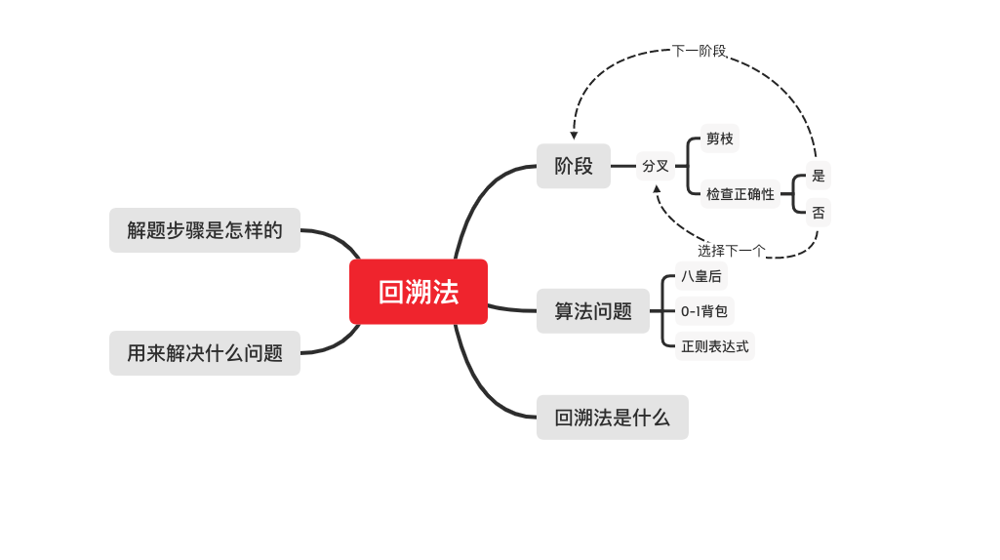

# 学习笔记

## 递归

```py
def recursion(level, param1, param2,...) {
  if level > MAX_LEVEL:
    process_end() # 递归终结条件
    return
   
    process(level, data...) # 处理当前逻辑
    result = self.recursion(level+1,p1,...)
    #下探到下一层, 可能会根据参数携带不同的状态下探的下一层。
    # 也可能有多个递归下探
    process_result() # 处理递归返回的结果
    # 清理当前层
}
```

## 分治
分治用来将问题分而治之，可分为以下几个骤
* 分解 将原问题分解一系列子问题
* 解决 递归求解各个子问题，若问题足够小，则直接求解
* 合并 将子问题解合并为原问题解

分治一般可将时间复杂度降为nlog(n)

## 回溯
回溯用来在一组可能的解中搜索符合条件的解，回溯的处理思想有点类似于枚举搜索，我们枚举所有的解，找到所有满足期望的解。为了有规律的枚举所有可能的解，
我们将问题求解的过程分解为多个阶段，每个阶段都会遇到不同的分支，先选中其中一个分支然后走下去，发现这条路走不通的时候（不符合期望的解），就回退到上一个岔路口，另选一种走法继续走。在选择分支时有时可以提前判断是否符合期望的解，如果不符合则提前放弃这条路，这称为剪枝。

经典的回溯法 1. 八皇后 2. 0-1背包 3. 正则表达式

### 技巧
1. 可以采用全局变量或传递参数维护路径上的一些状态，当回溯（返回）时，重置这些状态。
2. 在终止时把解加入结果集时，如果解是引用类型时需要copy


  
