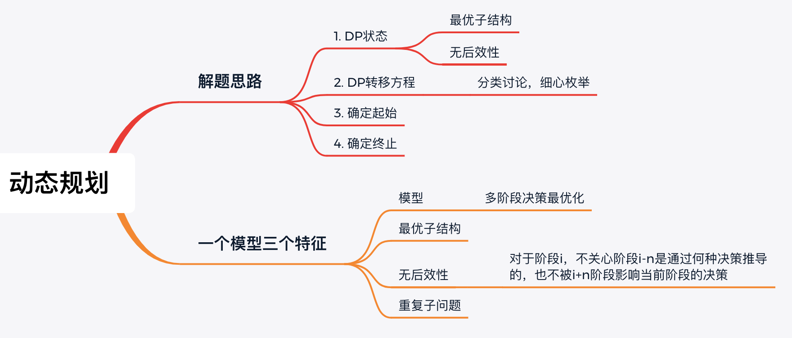

# 学习笔记

## 动态规划

应用动态规划的题目具有最优子结构和重复子问题这两个特点。

### 最优子结构

原问题的最优解参考或依赖于子问题的最优解，有时候子问题不一定是紧挨着的子问题，有可能是前几个阶段。

### 重复子问题

在求解大的问题中，会重复求解小的问题。可以画递归树来帮助理解。

## 动态规划解题思路

解题主要分为两个核心部分 1. 确定DP状态 2. 确定DP转移方程

### DP状态

DP状态的确定主要有两大原则 1. 最优子结构 2. 无后效性

什么是最优子结构？将原问题的解分为一个个子问题，而子问题的最优解由规模更小的子问题退出，此时子问题的最优解的即为DP状态的定义。

什么是无后效性？就是我们只关心子问题的最优值，不关心子问题的最优值是怎么来的。无论DP状态是怎么得到的，都不会影响后续DP状态的取值。如果不符合这个原则的话我们可能要定义多个DP状态。

### DP转移方程

有了DP状态，我们只需要用分类讨论的思想来枚举所有小状态向大状态转移的可能性即可推导出状态转移方程。

 
