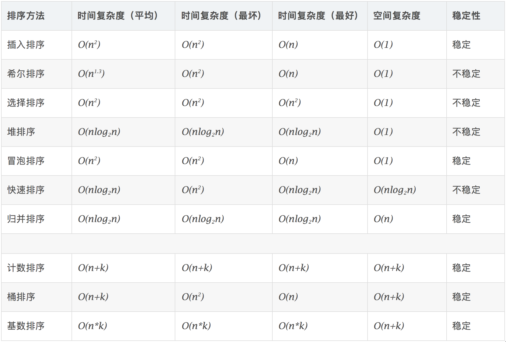

# 学习笔记


## 位运算

### 使用位运算将uint作为位集bitset

基本原理就是第n位代表数字n,比如第0位bit代表数字0,一般使用无符号整形作为一个集合，比如uint8可以可以代表0~7

有集合A B 
* A | B 并集
* A & B 交集
* A ^ B 对称差集 取集合 A 和 B 中不属于 A&B 的元素
* A &^ B 差集 取集合A中集合B没有的元素

### go中的位运算

* & AND 与
* | OR 或
* ^ XOR 异或 当作为一元运算符时为取反
* &^ 位清空
* << 左移
* \>\> 右移 有符号数的右移按符号位填补空位

### 常用位运算

* 右边n位清零 `uint(x) & (^uint(0) << n)`
* 获取第N位 `uint(x) >> n & 1`
* 设置第N位为1 `uint(x) | (uint(1) << n)`
* 设置第N位为0 `uint8(x) & (^(uint8(1) << n))`
* 获取最低位的1 `uint8(x) & uint8(-x) - 1` 下标从0开始
* 清除最低位1 `uint8(y) & (uint8(y) - 1)`


获取11110000，00001111这样的数字可以0取反后进行左右移

获取0001000 1左移

获取11101111 先取得0001000后取反


## 排序

排序算法可分为比较排序和非比较排序，非比较排序有计数排序和桶排序还有基数排序，但有个缺点就是要求排序对象需是整数。

非比较排序的基本思想就是分组，计数排序要求输入的数据必须是有确定范围的整数,具体方法是假设序列最大值为N,那么先申请一个大小为N的数组，那么数组索引和序列的整数就一一对应了
起来，这样就可以用对应的格子保存序列整数的计数。然后遍历序列计数序列整数出现的次数。最后遍历数组还原序列。

为了解决计数排序需要大量内存空间的问题，又出现了桶排序和计数排序。桶排序是选定一种映射函数将整数均匀分散到n个桶内（类似于哈希表），然后再对桶内的元素进行排序。

基数排序就是先按低位进行分组-排序然后再按较高位进行分组-排序....直到最高位


#### 初级比较排序算法

##### 选择排序

遍历序列n次，每一次遍历都能选择出一个最小值，最终能得出从小到大的序列。在编程上维护的是最小值的索引，这样方便交换

```go
func selectSort(nums []int) {
	for i := 0; i < len(nums); i++ {
		minIndex := i
		for j := i+1; j < len(nums); j++ {
			if nums[j] < nums[minIndex] {
				minIndex = j
			}
		}
		nums[i], nums[minIndex] = nums[minIndex], nums[i]
	}
}
```

##### 冒泡排序

相邻的元素两两比较，如果是逆序的话则交换，比如有序列[5,3,2,4]，5跟3比较，逆序，交换得[3,5,2,4]，然后5跟2比较...依次进行下去。这样每一趟遍历最大值就会被交换到最后
就像向上冒一样。所以每次排定的是最大值，每次遍历的区间由高到低递减的

```go
func bubbleSort(nums []int) {
	for i := len(nums) - 1; i >= 0; i-- {
		for j := 0; j < i; j++ {
			if nums[j] > nums[j+1] {
				nums[j], nums[j+1] = nums[j+1], nums[j]
			}
		}
	}
}
```

##### 插入排序

从前到后逐步构建有序序列
假设前n位是有序的，那么n+1位和前n位比较，找出小于他的那个位置，在那个位置后插入
如果序列是大部分有序的，插入排序有较好的性能，选择排序和冒泡排序不具有这个特点

```go
func insertSort(nums []int) {
	for i := 1; i < len(nums); i++ {
		j, curr := i, nums[i]
		for ; j > 0 && nums[j-1] > curr; j-- {
			nums[j] = nums[j-1]
		}
		nums[j] = curr
	}
}
```

#### 高级排序

##### 归并排序

归并排序是建立在归并操作上的一种有效的排序算法。该算法是采用分治法（Divide and Conquer）的一个非常典型的应用。将已有序的子序列合并，得到完全有序的序列；即先使每个子序列有序，再使子序列段间有序。若将两个有序序列合并成一个有序序列。是一种稳定的排序算法。有些时候我们还可能需要进行多路归并，比如当序列非常大，不能够完全放入内存时。多路归并需要使用到
索引堆。

归并排序的时间复杂度是nlog(n)，分析时画出递归树比较容易理解，递归树的深度是log2n, 每一层需要的比较次数是n, 所以总的时间复杂度是nlog(n), 
空间复杂度是n，归并时需要使用一个辅助数组

```go
func merge(nums []int, left int, mid int, right int) {
	aux := make([]int, right-left+1)
	i, j, k := left, mid+1, 0
	for i <= mid && j <= right {
		if nums[i] < nums[j] {
			aux[k] = nums[i]
			i++
		} else {
			aux[k] = nums[j]
			j++
		}
		k++
	}

	for i <= mid {
		aux[k] = nums[i]
		i++
		k++
	}
	for j <= right {
		aux[k] = nums[j]
		j++
		k++
	}

	for i := range aux {
		nums[left+i] = aux[i]
	}
}

func _mergeSort(nums []int, left int, right int) {
	if left >= right {
		return
	}
	mid := left + (right-left)/2
	_mergeSort(nums, left, mid)
	_mergeSort(nums, mid+1, right)
	merge(nums, left, mid, right)
}

func mergeSort(nums []int) {
	_mergeSort(nums, 0, len(nums)-1)
}

//自底向上的归并
func mergeSortBU(nums []int) {
	min := func(x int, y int) int {
		if x > y {
			return y
		}
		return x
	}

	numsLen := len(nums)
	for sz := 1; sz < numsLen; sz += sz {
		for left := 0; left < numsLen; left += sz + sz {
			mergeB(nums, left, left+sz-1, min(left+sz+sz-1, numsLen-1))
		}
	}
}

```

##### 快速排序

快速排序的基本思想：分组。首先选择一个枢纽元，使序列的左半边小于或等于枢纽元，右半边大于枢纽元，每次分组都可以排定一个元素，完成后继续对两边进行同样的操作，直到只有一个元素。

快速排序不是一个稳定的排序，比如有序列[3,6,4,1,3,6,1]，选择3作为枢纽元，则第一个6会被交换到第二个6后。

快速排序算法的时间复杂度和序列的无序性相关，序列的无序性越高，分组时就能把序列平均分成两半，这样递归树的深度就是log2N，每一层的比较次数是N，总的时间复杂度
是nlogn, 如果序列是逆序的，那么快速排序算法的时间复杂度将变为n2,因为每次分组后左半边的元素个数是0，这样递归树的深度就是N，每一层的比较次数是N，总的时间复杂度
是n2。

快速排序算法的空间复杂度是logN

```go
/*
i指针从左到右扫描，直到找到一个大于piviot的数字，j指针从右到左扫描直到找到小于piviot的数字，交换两个指针指向的数字，继续，直到left >= right

1. 数组有序递增
2. 数组有序递减
3. 普通情况
*/
func partition1(nums []int, left int, right int) int {
	piviot := left
	left++
	for {
		for left < right && nums[left] <= nums[piviot] {
			left++
		}

		for right >= left && nums[right] > nums[piviot] { //>=表明right最终可能的取值可为left-1
			right--
		}

		if left >= right {
			break
		}
		nums[left], nums[right] = nums[right], nums[left]
	}
	nums[piviot], nums[right] = nums[right], nums[piviot]
	return right
}

/*
主指针i负责遍历数组，指针counter指向大于pivot的元素
*/
func partition(nums []int, left int, right int) int {
	pivot := right
	counter := left
	for i := left; i < right; i++ {
		if nums[i] < nums[pivot] {
			// if counter != i {
			nums[counter], nums[i] = nums[i], nums[counter]
			// }
			counter++
		}
	}
	nums[counter], nums[pivot] = nums[pivot], nums[counter]
	return counter
}

func _quickSort(nums []int, left int, right int) {
	if left >= right {
		return
	}
	piviot := partition(nums, left, right)
	_quickSort(nums, left, piviot-1)
	_quickSort(nums, piviot+1, right)
}


func quickSort(nums []int) {
	_quickSort(nums, 0, len(nums)-1)
}
```


  


## 布隆过滤器

布隆过滤器解决的问题是判断某个元素是否在一个集合中，但这种判断不是一定准确的。基本的思想就是根据键不同的哈希值来标记对应的格子。因为格子的数量是有限的，所以不同键可能会标记了相同的格子，也正是因为这个原因布隆过滤器判断一个键是否存在是有误判的。显然格子的数量越多，不同键标记相同格子的几率就越低。根据可能重复标记事实我们得知当判断结果为true时，这个判定不一定是准确的，因为有可能是别的键的标记了。当判断结果为false时，这个判定一定是准确的。


## LRU缓存

LRU （Least Recently Used）缓存机制，即最近最少使用缓存，这个名字有点误导人。

核心的思想是 `最久未被使用的应该首先被淘汰`。

在实现上可以使用哈希表+双向链表。哈希表负责查询，双向链表决定哪个元素应该被淘汰。
下面是几个关键的点
* 新加入的元素总是最新的
* 最近访问过的元素应该被更新
* 当缓存满时应该先删除最久未被使用的

如果只用一种数据结构实现的话可以用小顶堆，不过查询速度会变为logK